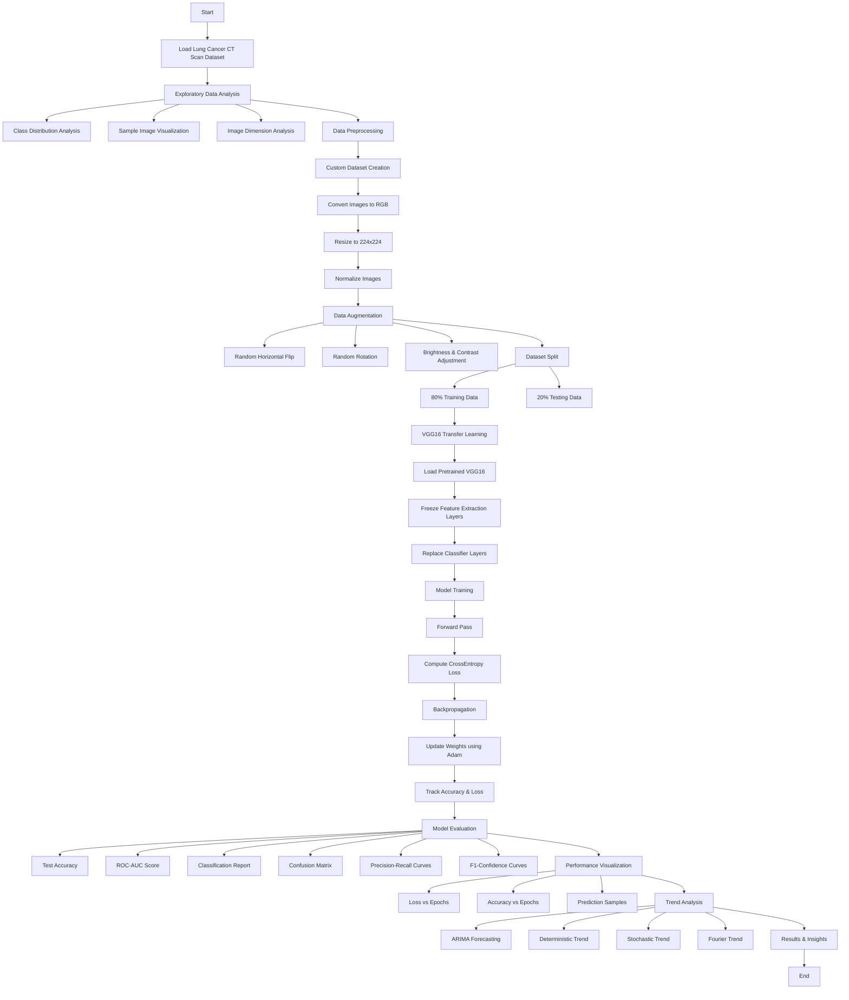

# Lung Cancer Classification Using Deep Learning (VGG16)

## Overview

This project develops a deep learning-based computer-aided diagnosis system for lung cancer classification using CT scan images. A pretrained VGG16 Convolutional Neural Network (CNN) is fine-tuned through transfer learning to classify lung cancer images into multiple categories. The workflow includes data exploration, preprocessing, augmentation, model training, evaluation, visualization, and time-series trend analysis of model performance.

---

## Features

* Exploratory Data Analysis (EDA)

  * Class distribution visualization
  * Sample CT image inspection
  * Image dimension analysis

* Data Preprocessing

  * Custom PyTorch Dataset implementation
  * Image normalization and resizing
  * Data augmentation techniques

* Deep Learning Model

  * Transfer Learning using VGG16
  * Frozen feature extraction layers
  * Custom classification head
  * Multi-class lung cancer classification

* Performance Evaluation

  * Accuracy
  * Cross-Entropy Loss
  * ROC-AUC Score
  * Classification Report
  * Confusion Matrix
  * Precision-Recall Curves
  * F1-Confidence Curves

* Trend Analysis

  * ARIMA Forecasting
  * Deterministic Trend Modeling
  * Stochastic Trend Analysis
  * Fourier Trend Analysis

---

## Dataset Structure

```text
lung_cancer_dataset/
│
├── train/
│   ├── Class_1/
│   ├── Class_2/
│   ├── Class_3/
│   └── Class_4/
│
└── test/
```

Each class folder contains CT scan images corresponding to a specific lung cancer category.

---

## Technologies Used

### Programming Language

* Python

### Deep Learning Framework

* PyTorch
* Torchvision

### Data Processing

* NumPy
* Pandas
* PIL

### Machine Learning & Statistics

* Scikit-learn
* Statsmodels

### Visualization

* Matplotlib
* Seaborn

---

## Data Augmentation

To improve model generalization, the following augmentations are applied:

* Random Horizontal Flip
* Random Rotation
* Brightness Adjustment
* Contrast Adjustment
* Image Normalization
* Center Cropping
* Image Resizing

---

## Model Architecture

### Base Model

* VGG16 (Pretrained on ImageNet)

### Custom Classifier

```python
Linear(25088 → 1024)
ReLU
Dropout(0.5)

Linear(1024 → 512)
ReLU
Dropout(0.5)

Linear(512 → Number_of_Classes)
```

### Training Configuration

| Parameter         | Value            |
| ----------------- | ---------------- |
| Optimizer         | Adam             |
| Learning Rate     | 0.0001           |
| Loss Function     | CrossEntropyLoss |
| Batch Size        | 32               |
| Epochs            | 10               |
| Transfer Learning | Yes              |

---

## Workflow

### 1. Exploratory Data Analysis

* Dataset inspection
* Class balance analysis
* Sample image visualization

### 2. Data Preprocessing

* Image resizing to 224×224
* RGB conversion
* Normalization using ImageNet statistics

### 3. Data Augmentation

* Apply random transformations during training

### 4. Model Training

* Fine-tune VGG16 classifier layers
* Monitor training loss and accuracy

### 5. Evaluation

* Test Accuracy
* ROC-AUC Score
* Classification Report
* Confusion Matrix

### 6. Trend Analysis

* Forecast future accuracy using ARIMA
* Compare deterministic, stochastic, and Fourier trends

---

## Performance Metrics

The model evaluation includes:

* Accuracy Score
* Macro ROC-AUC
* Precision
* Recall
* F1-Score
* Confusion Matrix
* Precision-Recall Curves

Example output:

```text
Test Accuracy: XX.XX%
Test AUC: XX.XX%
```

---

## Visualizations

The project generates:

* Class Distribution Charts
* Sample CT Scan Images
* Data Augmentation Results
* Training Loss vs Epochs
* Training Accuracy vs Epochs
* Confusion Matrix Heatmap
* Precision-Recall Curves
* F1-Confidence Curves
* ARIMA Forecasting Graphs
* Trend Analysis Comparisons

---

## Trend Analysis

To further analyze model behavior over time, the project applies:

### Deterministic Trend

Polynomial trend fitting using Ordinary Least Squares (OLS).

### Stochastic Trend

ARIMA(1,1,1) modeling for sequential learning behavior.

### Fourier Trend

Periodic pattern detection using Fourier series decomposition.

These analyses provide insights into learning dynamics and future performance trends.

---

## Installation

Clone the repository:

```bash
git clone https://github.com/yourusername/lung-cancer-classification-vgg16.git
cd lung-cancer-classification-vgg16
```

Install dependencies:

```bash
pip install torch torchvision numpy pandas matplotlib seaborn scikit-learn statsmodels pillow
```

---

## Running the Project

1. Upload the dataset.
2. Update the dataset path.
3. Run the notebook or Python script.

```bash
python lung_cancer_vgg16.py
```

or

```bash
jupyter notebook
```

---

## Future Improvements

* Experiment with ResNet50 and EfficientNet
* Hyperparameter Optimization
* Ensemble Learning
* Explainable AI (Grad-CAM)
* Cross-Validation
* Deployment using Flask or Streamlit
* Integration with Clinical Decision Support Systems

---

## Project Structure

```text
├── data/
├── notebooks/
├── models/
├── results/
├── figures/
├── lung_cancer_vgg16.py
├── README.md
└── requirements.txt
```

---

## Author

Dharm Patel

Master of Science in Computer Science
Lawrence Technological University

Portfolio: dharmhpatel.com

---

## License

This project is intended for academic and research purposes.


## Project Workflow


